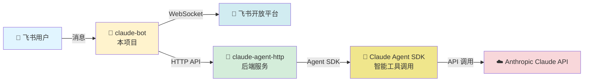

<div align="center">

# 🤖 飞书 Claude 机器人

[](https://opensource.org/licenses/MIT)
[](https://www.python.org/downloads/)
[](https://www.docker.com/)
[](https://cloud.tencent.com/product/tcr)
[](https://github.com/lflish/claude-lark)

**一个智能的飞书机器人，集成 Claude Code Agent AI，支持多轮对话和上下文记忆**

📦 **公共镜像**: `ccr.ccs.tencentyun.com/claude/claude-lark`

[功能特性](#-功能特性) • [快速开始](#-快速开始) • [配置说明](#️-配置说明) • [部署指南](#-部署方式对比) • [故障排查](#-故障排查)

</div>

---

## 📖 简介

本项目通过 [claude-agent-http](https://github.com/lflish/claude-agent-http) 后端服务，将基于 **Claude Agent SDK** 的智能 AI 能力集成到飞书（Lark/Feishu）平台。相比直接调用 Anthropic Claude API，Agent SDK 提供了更强大的工具调用、多轮推理和上下文管理能力，为企业和团队提供更智能的助手服务。

## 🏗️ 架构说明



**核心特性：**
- 🚀 **立即响应机制** - 防止飞书消息重复发送
- 🔄 **异步消息处理** - 后台队列处理，不阻塞主线程
- 💾 **会话持久化** - 支持多轮对话上下文
- 🧵 **智能线程关联** - 自动识别消息回复链

### ⚙️ 工作原理

1. **消息接收**: 通过 WebSocket 长连接接收飞书消息事件
2. **即时响应**: 消息立即入队并返回 200 OK，避免飞书重复投递
3. **后台处理**: Worker 线程异步处理队列中的消息
4. **会话管理**: 根据 `root_id`/`parent_id` 自动关联对话上下文
5. **AI 交互**: 调用 claude-agent-http 后端，通过 Claude Agent SDK 进行智能推理
6. **消息回复**: 使用飞书 API 回复消息并保存会话映射

### 🌟 为什么选择 Claude Agent SDK？

相比直接调用 Claude API，使用 **Claude Agent SDK** 带来以下优势：

- 🛠️ **工具调用能力**: 支持执行 Bash、文件操作、代码编辑等工具
- 🧠 **多轮推理**: 自动进行多步骤思考和任务分解
- 📝 **上下文管理**: 智能管理长对话上下文和会话状态
- 🔄 **自主决策**: 能够根据任务需求自主选择工具和策略
- ⚡ **更高效率**: 减少人工干预，自动完成复杂任务

## 🚀 快速开始

### 📋 前置条件

- ✅ Python 3.11+ 或 Docker 环境
- ✅ 部署 [claude-agent-http](https://github.com/lflish/claude-agent-http) 后端服务
- ✅ 在[飞书开放平台](https://open.feishu.cn/)创建应用并获取凭证

### ☁️ 使用公共镜像（最简单）

直接从腾讯云容器镜像仓库拉取已构建好的镜像，无需本地构建：

```bash
# 1. 拉取最新镜像
docker pull ccr.ccs.tencentyun.com/claude/claude-lark:v1.0.0-20260119

# 2. 配置环境变量
cp env.example .env
vim .env

# 3. 运行容器
docker run -d \
  --name claude-bot \
  --network host \
  -e APP_ID=cli_xxxxx \
  -e APP_SECRET=xxxxx \
  -e CLAUDE_AGENT_URL=http://localhost:8000 \
  -v ~/.claude-lark:/data/claude-lark \
  --restart unless-stopped \
  ccr.ccs.tencentyun.com/claude/claude-lark:v1.0.0-20260119

# 4. 查看日志
docker logs -f claude-bot
```

> 💡 **提示**：镜像托管在腾讯云 CCR，国内访问速度快，无需配置镜像加速器。

### 🐳 使用 Docker Compose 部署（推荐）

```bash
# 1. 配置环境变量
cp env.example .env
vim .env

# 2. 启动服务（包含 claude-bot 和 claude-agent-http）
docker-compose up -d

# 3. 查看日志
docker-compose logs -f claude-bot
```

### 📦 自己构建镜像（可选）

如果需要修改代码或自定义构建：

```bash
# 1. 克隆仓库
git clone https://github.com/lflish/claude-lark.git
cd claude-lark

# 2. 配置环境变量
cp env.example .env
vim .env

# 3. 构建镜像（自动生成带时间戳的版本标签）
./build.sh
# 将生成标签: ccr.ccs.tencentyun.com/claude/claude-lark:v1.0.0-20260119

# 4. 启动服务
./run.sh
# 或指定特定版本: ./run.sh v1.0.0-20260119

# 5. 推送到自己的镜像仓库（可选）
docker push ccr.ccs.tencentyun.com/claude/claude-lark:v1.0.0-20260119
```

### 🏷️ 版本管理

项目采用语义化版本号（Semantic Versioning）管理：

**镜像标签策略：**
- `v{VERSION}-{TIMESTAMP}` - 版本+时间戳（如 `v1.0.0-20260119`）
- 每次构建生成唯一的时间戳标签，方便版本追溯和回滚

**公共镜像仓库：**
```bash
# 查看可用版本
docker search ccr.ccs.tencentyun.com/claude/claude-lark

# 拉取指定版本
docker pull ccr.ccs.tencentyun.com/claude/claude-lark:v1.0.0-20260119
```

**自己构建镜像：**
```bash
# 查看当前版本
cat VERSION

# 构建镜像（自动生成带时间戳的标签）
./build.sh

# 查看已构建的镜像
docker images ccr.ccs.tencentyun.com/claude/claude-lark

# 使用特定版本
./run.sh v1.0.0-20260119

# 推送到自己的仓库
docker push ccr.ccs.tencentyun.com/claude/claude-lark:v1.0.0-20260119
```

**版本发布流程：**
1. 更新 `VERSION` 文件
2. 运行 `./build.sh` 构建新版本镜像
3. 推送到镜像仓库：`docker push ccr.ccs.tencentyun.com/claude/claude-lark:v{VERSION}-{TIMESTAMP}`
4. 提交代码并创建 git tag：`git tag v1.0.0 && git push --tags`

### 📊 部署方式对比

| 特性 | 公共镜像 | Docker Compose | 自己构建 |
|------|---------|---------------|---------|
| **适用场景** | 快速体验、生产环境 | 开发测试、一键部署 | 定制开发、私有部署 |
| **部署复杂度** | ⭐ 最简单（拉取即用） | ⭐⭐ 简单（一条命令） | ⭐⭐⭐ 中等（需构建） |
| **启动速度** | ⚡ 最快（无需构建） | 较快 | 较慢（需构建时间） |
| **网络依赖** | 需访问 CCR | 本地网络 | 本地构建 |
| **定制能力** | ❌ 不可修改 | ❌ 不可修改 | ✅ 完全可定制 |
| **推荐度** | ⭐⭐⭐⭐⭐ 首选 | ⭐⭐⭐⭐ 开发测试 | ⭐⭐⭐ 高级用户 |

## ⚙️ 配置说明

创建并编辑 `.env` 文件：

```bash
# 飞书应用配置（必填）
APP_ID=cli_xxxxx              # 飞书应用 ID
APP_SECRET=xxxxx              # 飞书应用密钥

# Claude Agent HTTP 后端配置（必填）
CLAUDE_AGENT_URL=http://claude-agent-http:8000  # Docker 网络使用服务名，本地开发使用 localhost:8000
CLAUDE_AGENT_TIMEOUT=300                        # 请求超时时间（秒），建议 300-600

# 会话存储配置（可选）
LOCAL_SESSION_DIR=~/.claude-lark        # 宿主机存储路径（容器内固定为 /data/claude-lark）

# 如果使用 docker-compose 一起部署 claude-agent-http
ANTHROPIC_API_KEY=sk-ant-xxxxx          # Claude API Key
```

### 🔑 获取飞书应用凭证

1. 访问 [飞书开放平台](https://open.feishu.cn/)
2. **创建企业自建应用**，获取 `App ID` 和 `App Secret`
3. **配置应用权限**：
   - `im:message` - 读取消息
   - `im:message.group_at_msg` - 接收群聊@消息
   - `im:message.p2p_msg` - 接收私聊消息
4. **启用事件订阅**：
   - 订阅事件：`im.message.receive_v1`
   - 连接模式：选择 **WebSocket 长连接**（无需配置回调地址）
5. **发布应用**并添加到工作区

### 🔧 claude-agent-http 后端配置

后端服务详细配置请参考 [claude-agent-http 文档](https://github.com/lflish/claude-agent-http)

<details>
<summary>📝 主要配置项示例（config.yaml）</summary>

```yaml
defaults:
  system_prompt: "你是一个专业的AI助手..."
  permission_mode: "bypassPermissions"
  allowed_tools:
    - "Bash"
    - "Read"
    - "Write"
    - "Edit"
    - "Glob"
    - "Grep"
```
</details>

## 🚀 生产环境部署建议

<details>
<summary><b>🔒 生产环境检查清单</b></summary>

**安全配置：**
- ✅ 使用强密码和密钥，定期轮换
- ✅ 限制飞书应用权限（最小权限原则）
- ✅ 配置日志文件大小限制（防止磁盘占满）
- ✅ 不要将 `.env` 文件提交到版本控制

**性能优化：**
- ✅ 设置合理的 `CLAUDE_AGENT_TIMEOUT` 值（300-600 秒，避免复杂任务超时）
- ✅ 配置资源限制（CPU、内存）
- ✅ 监控会话存储目录大小
- ✅ 定期清理过期会话数据

**高可用性：**
- ✅ 使用 `--restart unless-stopped` 自动重启
- ✅ 配置健康检查和告警
- ✅ 备份重要的会话映射数据
- ✅ 使用负载均衡（多实例部署）

**监控与日志：**
- ✅ 定期查看日志文件
- ✅ 监控 claude-agent-http 后端状态
- ✅ 跟踪 API 调用次数和成本
- ✅ 设置异常告警通知

</details>

## 🔧 常用命令

<table>
<tr>
<td><b>Docker Compose</b></td>
<td><b>Docker</b></td>
</tr>
<tr>
<td>

```bash
# 启动服务
docker-compose up -d

# 查看日志
docker-compose logs -f

# 只看 bot 日志
docker-compose logs -f claude-bot

# 重启服务
docker-compose restart

# 停止服务
docker-compose down
```

</td>
<td>

```bash
# 查看日志
docker logs -f claude-bot

# 重启容器
docker restart claude-bot

# 停止容器
docker stop claude-bot

# 删除容器
docker rm claude-bot
```

</td>
</tr>
</table>

## 📁 目录结构

```
claude-lark/
├── 📄 main.py              # 飞书机器人主程序（WebSocket + 消息队列）
├── 📄 handle.py            # Claude Agent HTTP 客户端封装
├── 📄 requirements.txt     # Python 依赖
├── 🏷️  VERSION              # 版本号文件
├── 🐳 Dockerfile           # Docker 镜像配置
├── 🐳 docker-compose.yml   # Docker Compose 配置（含后端服务）
├── 🚀 run.sh               # 单独启动脚本（支持版本选择）
├── 🔨 build.sh             # 镜像构建脚本（自动生成版本标签）
├── ⚙️  env.example          # 环境变量模板
├── 📖 README.md            # 项目文档
└── 📝 CLAUDE.md            # Claude Code 开发指南
```

## 📚 API 说明

### `handle.py` - Claude Agent HTTP 客户端

#### 🔌 `ClaudeAgentClient` 类

封装与 claude-agent-http 后端的交互：

<details>
<summary>💡 示例代码</summary>

```python
from handle import ClaudeAgentClient

# 创建客户端
client = ClaudeAgentClient(base_url="http://localhost:8000")

# 创建会话
session = client.create_session(user_id="user123")

# 发送消息
response = client.chat(
    session_id=session["session_id"],
    message="你好，请介绍一下自己"
)

# 关闭会话
client.close_session(session_id=session["session_id"])
```
</details>

#### 📡 `ask_claude_sync(user_prompt, user_id, session_id)`

同步调用 Claude AI 的便捷函数。

**参数：**
- `user_prompt` (str): 用户消息
- `user_id` (str): 用户标识
- `session_id` (str, optional): 已有会话ID，留空则创建新会话

**返回值：**
```python
{
    'content': str,          # AI 回复内容
    'session_id': str,       # 会话 ID（用于后续对话）
    'timestamp': str,        # 时间戳
    'error': str | None      # 错误信息（无错误时为 None）
}
```

## ✨ 功能特性

<table>
<tr>
<td width="50%">

### 💬 对话能力
- ✅ 私聊和群聊支持
- ✅ @机器人触发回复（群聊）
- ✅ 多轮对话上下文记忆
- ✅ 消息引用回复
- ✅ 智能线程追踪

</td>
<td width="50%">

### 🛠️ 技术特性
- ✅ 异步消息处理队列
- ✅ 自动重试机制
- ✅ 会话持久化存储
- ✅ 健康检查监控
- ✅ LRU 会话管理

</td>
</tr>
</table>

## 🐛 故障排查

<details>
<summary><b>❌ 容器无法启动</b></summary>

```bash
# 查看容器日志
docker logs claude-bot

# 检查环境变量配置
docker inspect claude-bot | grep -A 20 "Env"
```
</details>

<details>
<summary><b>🔇 机器人无响应</b></summary>

1. **检查飞书应用配置**
   - 确认权限已正确配置
   - 确认事件订阅已启用
   - 确认使用 WebSocket 模式

2. **查看日志**
   ```bash
   docker logs -f claude-bot
   ```

3. **检查 WebSocket 连接**
   - 日志中应显示 "机器人启动完成"
</details>

<details>
<summary><b>🔌 Claude Agent HTTP 连接失败（Connection refused on localhost:8000）</b></summary>

**错误现象：**
```
HTTPConnectionPool(host='localhost', port=8000): Max retries exceeded
Connection refused [Errno 111]
```

**原因分析：**
使用 Docker Compose 时，容器在独立网络中，`localhost` 指向容器自己而非其他容器或宿主机。

**解决方案：**

1. **修改 `.env` 文件中的 CLAUDE_AGENT_URL**
   ```bash
   # ❌ 错误配置（Docker Compose）
   CLAUDE_AGENT_URL=http://localhost:8000

   # ✅ 正确配置（Docker Compose - 使用服务名）
   CLAUDE_AGENT_URL=http://claude-agent-http:8000

   # ✅ 正确配置（run.sh 单独部署 - 使用 localhost）
   CLAUDE_AGENT_URL=http://localhost:8000
   ```

2. **重新构建并启动容器**
   ```bash
   # 使用 Docker Compose
   docker-compose down
   docker-compose build
   docker-compose up -d

   # 或使用 run.sh
   docker stop claude-bot && docker rm claude-bot
   ./build.sh
   ./run.sh
   ```

3. **验证后端服务状态**
   ```bash
   # 检查 claude-agent-http 是否正常运行
   docker ps | grep claude-agent-http

   # 从宿主机测试连接
   curl http://localhost:8000/health
   ```

**部署方式对比：**
| 部署方式 | CLAUDE_AGENT_URL | 网络模式 |
|---------|------------------|---------|
| Docker Compose | `http://claude-agent-http:8000` | Docker 独立网络 |
| run.sh（host 网络） | `http://localhost:8000` | 宿主机网络 |
| run.sh（bridge 网络） | 后端容器 IP 或服务名 | Docker bridge |

</details>

<details>
<summary><b>⚠️ API 调用失败</b></summary>

1. 检查 claude-agent-http 的日志
2. 确认 `ANTHROPIC_API_KEY` 配置正确
3. 检查 API 配额和限流
</details>

## 📦 依赖包

| 包名 | 版本 | 用途 |
|------|------|------|
| `lark-oapi` | ≥1.4.8 | 飞书开放平台 SDK |
| `requests` | ≥2.31.0 | HTTP 客户端库 |

## 🔗 相关项目

- 🔧 [claude-agent-http](https://github.com/lflish/claude-agent-http) - Claude Agent HTTP 后端服务（基于 Agent SDK）
- 🤖 [Claude Agent SDK](https://github.com/anthropics/anthropic-sdk-python) - Anthropic Claude Agent SDK
- 📱 [飞书开放平台](https://open.feishu.cn/) - 官方开发文档
- ☁️ [Claude API](https://docs.anthropic.com/) - Anthropic Claude API 文档
- 📦 [腾讯云容器镜像服务](https://cloud.tencent.com/product/tcr) - 公共镜像托管平台

## 🤝 贡献

欢迎提交 Issue 和 Pull Request！

## 📄 许可证

本项目采用 [MIT License](LICENSE) 开源许可证。

---

<div align="center">

**如果这个项目对你有帮助，请给一个 ⭐️ Star 支持一下！**

Made with ❤️ by [lflish](https://github.com/lflish)

</div>
