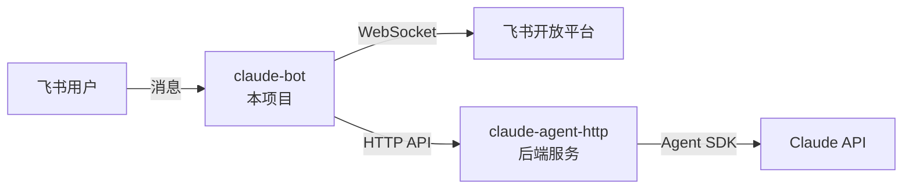

<div align="center">

# 飞书 Claude 机器人

[](https://opensource.org/licenses/MIT)
[](https://www.python.org/downloads/)
[](https://www.docker.com/)
[](https://github.com/lflish/claude-lark)

**一个智能的飞书机器人，集成 Claude Code Agent AI，支持多轮对话和上下文记忆**

[功能特性](#-功能特性) • [快速开始](#-快速开始) • [配置说明](#️-配置说明) • [故障排查](#-故障排查)

</div>

---

## 简介

本项目通过 [claude-agent-http](https://github.com/lflish/claude-agent-http) 后端服务，将基于 **Claude Agent SDK** 的智能 AI 能力集成到飞书（Lark/Feishu）平台。

## 架构说明



**核心特性：**
- **立即响应机制** - 防止飞书消息重复发送
- **异步消息处理** - 后台队列处理，不阻塞主线程
- **会话持久化** - 支持多轮对话上下文
- **智能线程关联** - 自动识别消息回复链

### 工作原理

1. **消息接收**: 通过 WebSocket 长连接接收飞书消息事件
2. **即时响应**: 消息立即入队并返回 200 OK，避免飞书重复投递
3. **后台处理**: Worker 线程异步处理队列中的消息
4. **会话管理**: 根据 `root_id`/`parent_id` 自动关联对话上下文
5. **AI 交互**: 调用 claude-agent-http 后端获取回复
6. **消息回复**: 使用飞书 reply API 引用回复

## 前置条件

- Python 3.11+ 或 Docker 环境
- 已部署 [claude-agent-http](https://github.com/lflish/claude-agent-http) 后端服务
- 在[飞书开放平台](https://open.feishu.cn/)创建应用并获取凭证

## 快速开始

### Docker Compose 部署（推荐）

```bash
# 1. 克隆仓库
git clone https://github.com/lflish/claude-lark.git
cd claude-lark

# 2. 配置环境变量
cp env.example .env
vim .env

# 3. 构建并启动
docker-compose up -d --build

# 4. 查看日志
docker logs -f claude-bot
```

### 本地开发

```bash
# 安装依赖
pip install -r requirements.txt

# 配置环境变量
cp env.example .env
vim .env

# 启动
python main.py
```

## 配置说明

编辑 `.env` 文件：

```bash
# 飞书应用配置（必填）
APP_ID=cli_xxxxx              # 飞书应用 ID
APP_SECRET=xxxxx              # 飞书应用密钥

# Claude Agent HTTP 后端配置（必填）
CLAUDE_AGENT_URL=http://127.0.0.1:8000  # 后端服务地址
CLAUDE_AGENT_TIMEOUT=300                # 请求超时时间（秒），建议 300-600

# 会话存储配置（可选）
LOCAL_SESSION_DIR=~/.claude-lark        # 宿主机存储路径
```

> 容器使用 host 网络模式，直接通过 `127.0.0.1` 访问宿主机上的 claude-agent-http 服务。

### 获取飞书应用凭证

1. 访问 [飞书开放平台](https://open.feishu.cn/)
2. **创建企业自建应用**，获取 `App ID` 和 `App Secret`
3. **配置应用权限**：
   - `im:message` - 读取消息
   - `im:message.group_at_msg` - 接收群聊@消息
   - `im:message.p2p_msg` - 接收私聊消息
4. **启用事件订阅**：
   - 订阅事件：`im.message.receive_v1`
   - 连接模式：选择 **WebSocket 长连接**（无需配置回调地址）
5. **发布应用**并添加到工作区

### claude-agent-http 后端

后端服务需独立部署，详见 [claude-agent-http 文档](https://github.com/lflish/claude-agent-http)。

## 常用命令

```bash
# 构建并启动
docker-compose up -d --build

# 查看日志
docker logs -f claude-bot

# 重启
docker restart claude-bot

# 停止
docker-compose down
```

## 目录结构

```
claude-lark/
├── main.py              # 飞书机器人主程序（WebSocket + 消息队列）
├── handle.py            # Claude Agent HTTP 客户端封装
├── requirements.txt     # Python 依赖
├── Dockerfile           # Docker 镜像配置
├── docker-compose.yml   # Docker Compose 配置
├── env.example          # 环境变量模板
├── build.sh             # 镜像构建脚本
├── run.sh               # 单独启动脚本
├── VERSION              # 版本号文件
├── README.md            # 项目文档
└── CLAUDE.md            # Claude Code 开发指南
```

## 功能特性

| 对话能力 | 技术特性 |
|---------|---------|
| 私聊和群聊支持 | 异步消息处理队列 |
| @机器人触发回复（群聊） | 自动重试机制（指数退避） |
| 多轮对话上下文记忆 | 会话持久化存储（v2.0 格式） |
| 消息引用回复 | LRU 会话管理（最多 1000） |
| 智能线程追踪 | 启动健康检查 |

## 故障排查

<details>
<summary><b>机器人无响应</b></summary>

1. 检查飞书应用权限和事件订阅是否正确配置
2. 确认使用 WebSocket 连接模式
3. 查看日志：`docker logs -f claude-bot`
4. 日志中应显示 "机器人启动完成" 和 WebSocket connected
</details>

<details>
<summary><b>Claude Agent HTTP 连接失败</b></summary>

```bash
# 确认后端服务正在运行
curl http://127.0.0.1:8000/health

# 确认 .env 中 URL 配置正确
# 容器使用 host 网络，应使用 127.0.0.1
CLAUDE_AGENT_URL=http://127.0.0.1:8000
```
</details>

<details>
<summary><b>API 调用超时</b></summary>

复杂任务可能需要较长处理时间，调大超时值：
```bash
CLAUDE_AGENT_TIMEOUT=600
```
</details>

## 依赖

| 包名 | 版本 | 用途 |
|------|------|------|
| `lark-oapi` | >=1.4.8 | 飞书开放平台 SDK |
| `requests` | >=2.31.0 | HTTP 客户端库 |

## 相关项目

- [claude-agent-http](https://github.com/lflish/claude-agent-http) - Claude Agent HTTP 后端服务
- [飞书开放平台](https://open.feishu.cn/) - 官方开发文档

## 许可证

本项目采用 [MIT License](LICENSE) 开源许可证。
